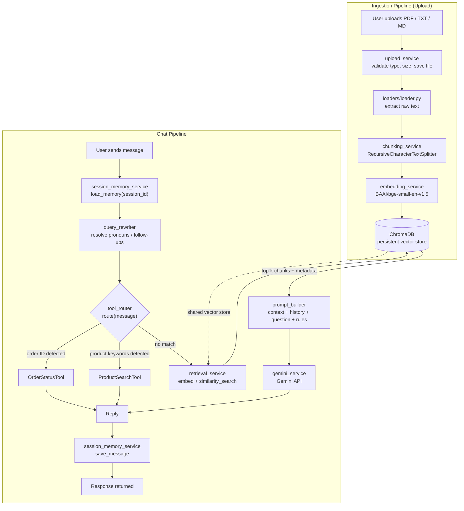

# Mini AI Assistant

A production-ready AI assistant built with FastAPI, LangChain, ChromaDB, and Google Gemini. It ingests documents (PDF, TXT, Markdown), answers questions grounded in that content via Retrieval-Augmented Generation (RAG), remembers conversation context per session, and can call tools (order status, product search) instead of hitting the LLM when a simple lookup will do.

## Tech Stack

| Component | Technology |
|---|---|
| API framework | FastAPI |
| LLM | Google Gemini |
| Orchestration | LangChain |
| Vector store | ChromaDB (persistent) |
| Embeddings | Sentence Transformers (`BAAI/bge-small-en-v1.5`) |
| PDF parsing | PyMuPDF |
| Language | Python 3.11 |

---

## Installation

### Option A — Local (venv)

```powershell
# 1. Clone/open the project, then create a virtual environment
python -m venv venv
venv\Scripts\activate          # Windows
# source venv/bin/activate     # macOS/Linux

# 2. Install dependencies
pip install -r requirements.txt

# 3. Copy the environment template and fill in your real values
copy .env.example .env         # Windows
# cp .env.example .env         # macOS/Linux
```

Open `.env` and set at minimum:

```
GOOGLE_API_KEY=your-real-gemini-api-key
```

### Option B — Docker

Requires Docker Desktop installed and running. No local Python setup needed.

```bash
docker compose up --build
```

This builds the image, installs all dependencies inside the container, and starts the API. Your `data/`, `uploads/`, and `logs/` folders are mounted as volumes, so indexed documents and vector data persist across container restarts.

---

## Running

### Local

```powershell
uvicorn app.main:app --reload
```

The API will be available at:
- **Base URL:** `http://127.0.0.1:8000`
- **Interactive docs (Swagger UI):** `http://127.0.0.1:8000/docs`

### Docker

```bash
docker compose up
```

Same URLs, served from inside the container.

---

## API Endpoints

All endpoints are prefixed with `/api/v1`.

| Method | Endpoint | Description |
|---|---|---|
| `GET` | `/api/v1/health` | Returns service status, app name, and environment. |
| `POST` | `/api/v1/upload` | Uploads a `.pdf`, `.txt`, or `.md` file. Extracts text, chunks it, embeds it, and stores it in ChromaDB. |
| `POST` | `/api/v1/chat` | Sends a message for a given `session_id`. Routes to a tool (order/product lookup) or falls back to RAG + Gemini. Returns a reply and updates conversation memory. |

### Example: Upload a document

```bash
curl -X POST http://127.0.0.1:8000/api/v1/upload \
  -F "file=@document.pdf"
```

Response:
```json
{
  "filename": "document.pdf",
  "saved_path": "uploads/ab12cd34_document.pdf",
  "content_type": "application/pdf",
  "size_bytes": 107123,
  "chunks_indexed": 8,
  "message": "Document Indexed Successfully"
}
```

### Example: Chat

```bash
curl -X POST http://127.0.0.1:8000/api/v1/chat \
  -H "Content-Type: application/json" \
  -d '{"session_id": "user-123", "message": "What is the status of order ORD1001?"}'
```

Response:
```json
{
  "session_id": "user-123",
  "reply": "Order ORD1001 status: Shipped. Estimated delivery: 2026-07-05."
}
```

Full request/response schemas, including validation rules and error responses, are available at `/docs`.

---

## Folder Structure

```
mini-ai-assistant/
├── app/
│   ├── main.py                      # FastAPI app, startup/shutdown, global exception handlers
│   ├── core/
│   │   ├── config.py                 # Settings loaded from environment variables
│   │   ├── logging_config.py         # Logging setup
│   │   └── exceptions.py             # Custom exception hierarchy (ValidationError, NotFoundError, ExternalServiceError)
│   ├── schemas/                      # Pydantic request/response models
│   │   ├── upload.py
│   │   ├── chat.py
│   │   ├── health.py
│   │   └── common.py                 # Shared ErrorResponse model
│   ├── services/
│   │   ├── upload_service.py         # File validation and saving
│   │   ├── loaders/                  # PDF / TXT / Markdown text extraction
│   │   ├── chunking_service.py       # RecursiveCharacterTextSplitter wrapper
│   │   ├── embedding_service.py      # Sentence Transformers wrapper
│   │   ├── vector_store_service.py   # ChromaDB add/search
│   │   ├── ingestion_service.py      # Orchestrates load → chunk → embed → store
│   │   ├── retrieval_service.py      # Embeds a question, runs similarity search
│   │   ├── prompt_builder.py         # Builds the final LLM prompt
│   │   ├── gemini_service.py         # Gemini API wrapper
│   │   ├── session_memory_service.py # Per-session conversation history
│   │   ├── query_rewriter.py         # Resolves pronouns/follow-ups using history
│   │   ├── tool_router.py            # Detects order/product queries vs. general questions
│   │   └── chat_service.py           # Orchestrates the full chat turn
│   ├── tools/
│   │   ├── base.py                   # Abstract Tool interface
│   │   ├── registry.py               # Tool registration/lookup
│   │   ├── order_status_tool.py
│   │   └── product_search_tool.py
│   └── api/v1/
│       ├── router.py                 # Aggregates all routers
│       └── endpoints/                # health.py, upload.py, chat.py
├── data/
│   ├── chroma_db/                    # Persistent vector store (gitignored)
│   ├── orders.json                   # Sample order data
│   └── products.json                 # Sample product data
├── uploads/                          # Saved uploaded files (gitignored)
├── logs/
├── tests/                            # Unit tests (pytest)
├── conftest.py
├── Dockerfile
├── docker-compose.yml
├── requirements.txt
├── .env.example
└── README.md
```

---

## Architecture

There are two pipelines: **ingestion** (runs once per uploaded document) and **chat** (runs on every message).



**Key design decisions:**
- **Tool routing bypasses the LLM entirely** for order/product lookups — faster and cheaper than always calling Gemini.
- **Strict grounding:** the prompt instructs Gemini to answer only from retrieved context or conversation history, and to return a fixed fallback message otherwise — this prevents hallucination.
- **Session memory is in-memory** (a Python dict), which means it resets on server restart. See *Future Improvements*.
- **Custom exception hierarchy** (`ValidationError`, `NotFoundError`, `ExternalServiceError`) maps to meaningful HTTP status codes via global handlers, so every error returns a clean, logged, client-safe response.

---

## Environment Variables

All configuration is read from `.env` (see `.env.example` for the full template).

| Variable | Default | Description |
|---|---|---|
| `APP_NAME` | `mini-ai-assistant` | Application name, shown in `/health`. |
| `APP_ENV` | `development` | Environment label. |
| `LOG_LEVEL` | `INFO` | Logging verbosity. |
| `GOOGLE_API_KEY` | *(required)* | Your Gemini API key. |
| `GEMINI_MODEL` | `gemini-1.5-flash` | Gemini model used for chat and query rewriting. |
| `EMBEDDING_MODEL` | `BAAI/bge-small-en-v1.5` | Sentence Transformers model for embeddings. |
| `CHROMA_PERSIST_DIR` | `./data/chroma_db` | Where ChromaDB stores its data. |
| `CHROMA_COLLECTION_NAME` | `knowledge_base` | ChromaDB collection name. |
| `CHUNK_SIZE` | `1000` | Max characters per chunk. |
| `CHUNK_OVERLAP` | `150` | Overlap between adjacent chunks. |
| `UPLOAD_DIR` | `./uploads` | Where uploaded files are saved. |
| `MAX_UPLOAD_SIZE_MB` | `20` | Max allowed upload size. |
| `ORDERS_DATA_PATH` | `./data/orders.json` | Data file for the Order Status tool. |
| `PRODUCTS_DATA_PATH` | `./data/products.json` | Data file for the Product Search tool. |
| `API_HOST` / `API_PORT` | `0.0.0.0` / `8000` | Server bind address/port. |

---

## Future Improvements

- **Persistent session memory** — currently in-memory (resets on restart); could move to Redis or a database without changing the `save_message`/`load_memory` interface.
- **Smarter product tool** — add real filtering (e.g., "cheaper than X", "in stock only") instead of name substring matching only.
- **Authentication** — no auth is currently implemented on any endpoint.
- **Rate limiting** — none currently, relevant before any public deployment.
- **Streaming responses** — Gemini calls are currently synchronous/blocking; streaming would improve perceived latency in chat.
- **More file types** — currently PDF/TXT/MD only; DOCX support would be a natural next loader.
- **Async I/O** — file reads/writes in the upload and loader services are currently blocking calls inside async endpoints.
- **Observability** — no metrics/tracing yet; useful before production traffic.
- **CI pipeline** — tests exist (`pytest`, 33 passing) but aren't yet wired into an automated CI workflow.

---

## Troubleshooting

**`ERROR: Could not open requirements file`**
You're in the wrong directory. `cd` into the `mini-ai-assistant` folder (the one containing `requirements.txt`) before running `pip install`.

**`{"detail":"Not Found"}` when visiting the root URL**
Expected — there's no route at `/`. Use `/api/v1/health` or `/docs` instead.

**First chat/upload request is very slow**
The embedding model (`BAAI/bge-small-en-v1.5`) downloads from Hugging Face on first use (~130MB) and is cached afterward. This also happens again inside a fresh Docker container, since it has its own filesystem separate from your local machine's cache.

**`400 Unsupported file type` on upload**
Only `.pdf`, `.txt`, and `.md` are supported. Other formats (e.g. `.docx`) are rejected by design.

**Gemini calls failing with `502 Bad Gateway`**
Check that `GOOGLE_API_KEY` is set correctly in `.env` (not `.env.example`) and that the key is valid and has quota remaining.

**Chat always returns "I couldn't find that information in the uploaded documents."**
This means no document has been indexed yet for this ChromaDB collection, or the question doesn't semantically match anything indexed. Upload a relevant document via `/api/v1/upload` first.

**`pip install` fails on `sentence-transformers` or `torch`**
This is normal on slower connections — these packages are large. Ensure you have a stable connection and enough disk space (a few GB).

**Docker build is slow / seems stuck**
Installing PyTorch (a `sentence-transformers` dependency) inside the container takes time on first build. Subsequent builds are faster due to Docker's layer caching (as long as `requirements.txt` hasn't changed).

**Python 3.14 compatibility issues**
This project targets Python 3.11. If you have a newer Python version installed system-wide, create your virtual environment explicitly with 3.11 (e.g. `py -3.11 -m venv venv` on Windows) to avoid dependency resolution errors.